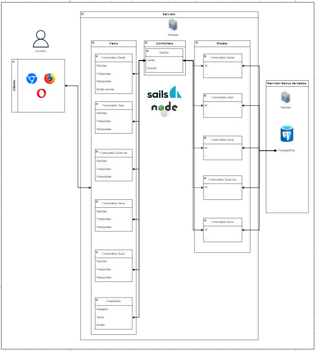

O MVC é um padrão de arquitetura de software que se divide em três camadas distintas:

View: Responsável pela interação com o usuário.
Controller: Encarregado do controle das operações.
Model: Manipula os dados do sistema.
Este padrão é amplamente adotado devido à sua capacidade de escalabilidade.

